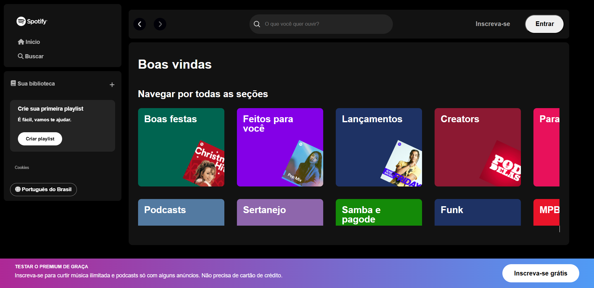

<h1 align="center">Imersão DEV | Spotify Alura</h1>

<p align="center">
    Programa promovido pela plataforma Alura
</p>

<p align="center">
  <a href="#-tecnologias">Tecnologias</a>&nbsp;&nbsp;&nbsp;|&nbsp;&nbsp;&nbsp;
  <a href="#-projeto">Projeto</a>&nbsp;&nbsp;&nbsp;|&nbsp;&nbsp;&nbsp;
  <a href="#-layout">Layout</a>&nbsp;&nbsp;&nbsp;|&nbsp;&nbsp;&nbsp;
  <a href="#-Instruções">Instruções</a>
</p>

## 💻 Tecnologias 
Esse projeto foi desenvolvido com as seguintes tecnologias:

- HTML
- CSS
- JavaScript
- Json
- Node.Js

## 	🎵 Projeto
O Sportify Alura, é um projeto desenvolvido no intuito de praticar conceitos como DOM (Document Object Model), API REST usada para fazer requerimentos do nosso objeto Json e muito mais.
## 📃 Layout
Você poderá ver como está este projeto da seguinte forma:

ou seguindo os próximos passos no próximo tópico.

## 🎲 Instruções
- O primeiro passo, é instalar o Node.js em sua máquina, pois, precisaremos do NPM (gerenciador de pacotes), sendo um kit de ferramentes para desenvolvimento.
- Depois de instalado, abra o seu VsCode, baixe todos os arquivos do GitHub.

Usando o seguinte comando: 
```git
git clone <URL do repositório>
```
Depois, inicie o terminal em sua máquina e coloque os seguintes comandos:
```npm
npm i json-server -g
```
logo em seguida:
```npm
json--server --watch api-projeto/projeto.json --port 3000
```

